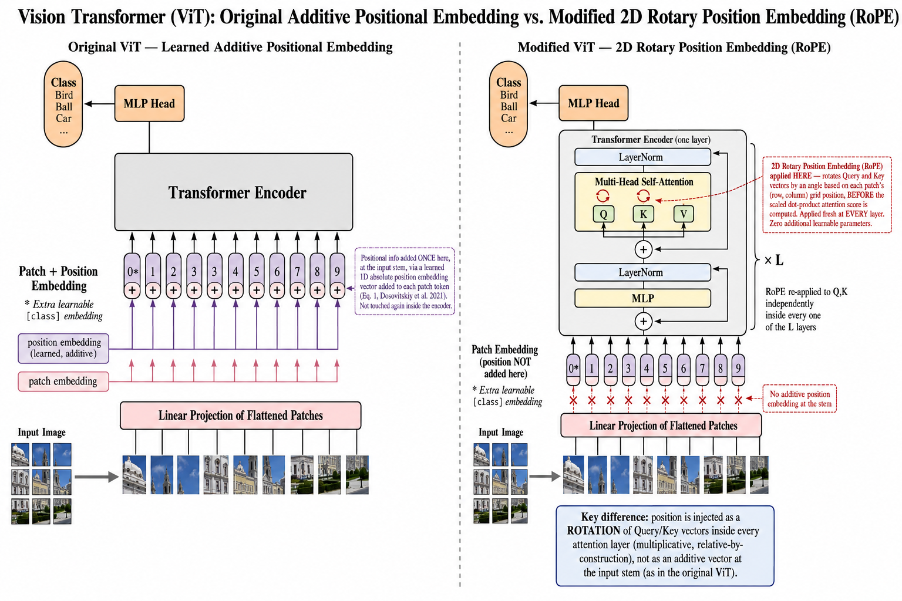

# 🚀 ViT Positional Embedding Comparison




## 📌 Problem Statement
The goal of this project is to compare two variants of the Vision Transformer (ViT) on the CIFAR-10 dataset:
1. **Original ViT:** Uses the standard learned additive 1D positional embedding (as described in Dosovitskiy et al., 2021).
2. **Modified ViT (RoPE):** Replaces the additive positional embedding module with a multiplicative **2D Rotary Position Embedding (RoPE)** scheme.

Both variants share exactly the same hyperparameters (model size, patch size, depth) and are trained entirely from scratch (no pre-trained weights) to optimize their respective validation performance.

---

## 🎯 Deliverables (Quick Links)

Faculty and reviewers can use the clickable buttons below to instantly jump to the required deliverables in the codebase:

[](results/comparison/top1_test_accuracy_comparison.json)
[](results/comparison/combined_loss_curves.png)
[](report/justification.md)
[](report/discussion.md)
[](CHANGES.md)

### 🧑‍💻 Full Codebases
* **Original ViT Codebase:** [`src/vit_original/vit.py`](src/vit_original/vit.py)
* **Modified ViT Codebase:** [`src/vit_modified/vit.py`](src/vit_modified/vit.py) & [`src/vit_modified/positional_embeddings.py`](src/vit_modified/positional_embeddings.py)

---

## 🛠️ How to Clone and Setup

```bash
git clone https://github.com/Sagnik120/vit-positional-embedding-comparison.git
cd vit-positional-embedding-comparison
```

### Windows Setup
```powershell
python -m venv .venv
.venv\Scripts\activate
python -m pip install --upgrade pip
pip install -r requirements.txt
```

### macOS / Linux Setup
```bash
python3 -m venv .venv
source .venv/bin/activate
pip3 install --upgrade pip
pip3 install -r requirements.txt
```

---

## 🚀 How to Run the Pipeline

### 1. Download CIFAR-10
```bash
python scripts/download_data.py
```

### 2. Run Diagnostics (Recommended)
Validates architecture parity and runs smoke tests. All checks must pass.
```bash
python scripts/run_diagnostics.py
```

### 3. Train Both Models
```bash
bash scripts/train_baseline.sh      # Trains the original ViT
bash scripts/train_modified.sh      # Trains the RoPE ViT
```
*(Alternatively, run `bash scripts/run_all.sh` to execute the entire pipeline automatically).*

### 4. Evaluate and Generate Comparison
```bash
cd src
python -m common.evaluate --model original --out ../results/baseline
python -m common.evaluate --model modified --out ../results/modified_rope
cd ..
python scripts/evaluate_all.py
```
This will automatically evaluate the models and populate the `results/comparison/` folder with the final metrics and plots!

---

## 📊 Final Results Summary

| Metric | Original ViT | Modified ViT (RoPE) |
|---|---|---|
| **Top-1 Test Accuracy** | 83.73% | **86.77%** |
| **Best Val Accuracy** | 0.8428 | **0.8706** |
| **Best Epoch** | 80 | 90 |

**Delta: +3.04 percentage points in favor of RoPE.**
